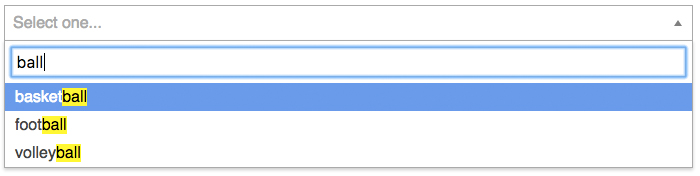
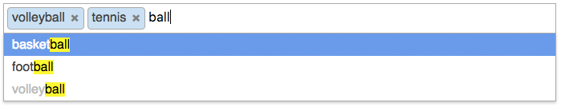
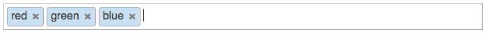

# selectko component for Knockout JS
Replacement for select boxes, similar to jQuery select2 but much slimmer. Supports single selects, multi selects, and tagging.

- Single select

- Multi select

- Tagging

## Using
Just clone this repo, open `index.html` in your browser, and look at the examples. This demo includes the selectko component and shows you how to use it.

## Dependencies
Only Knockout JS (only tested with >=3.3).

## License
MIT